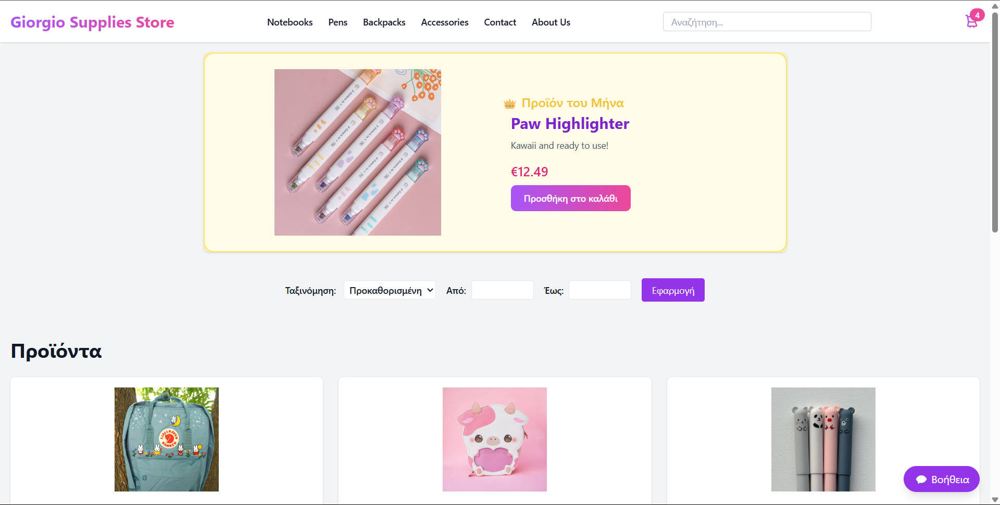
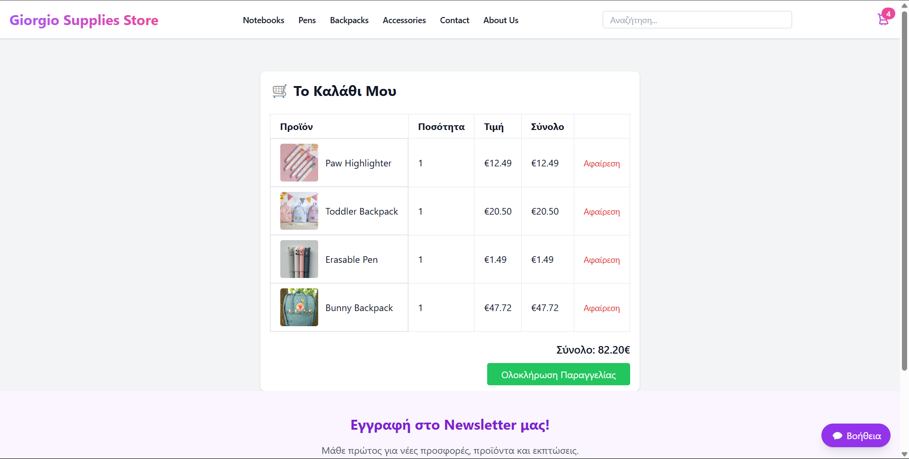
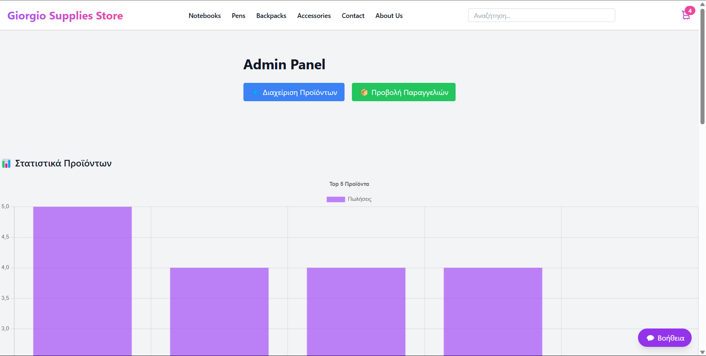

# 🛒 Giorgio Supplies Store

Welcome to the **Giorgio Supplies Store** — a modern and minimal e-commerce web app built for selling essential student supplies like notebooks, pens, backpacks, and more!

Built with ❤️ using **PHP**, **MySQL**, **Tailwind CSS**, and **Vanilla JavaScript**!

---

## 🚀 Features

- 🏠 Home page displaying all products  
- 🔍 Live search bar with autocomplete suggestions + clear/reset button  
- 🛒 Fully functional cart using `localStorage`  
- 📋 Product details page  
- 🧾 Checkout form (name & email), saving orders to DB  
- 🛠️ Admin panel:  
  - Product management (add, edit, delete)  
  - Order list  
  - Product analytics with Chart.js (Top Products + Revenue)  
- 🎠 Random featured carousel  
- 📂 Categories menu with category pages  
- 📩 Newsletter subscription form in footer  
- 🛍️ Mini-cart preview dropdown on hover  
- 📄 Pagination, price filtering, sorting  
- 👑 Product of the month highlight  
- 🎨 Smooth design and transitions  
- ⚡ Sticky header for easy navigation  

---

## 📸 Screenshots

### 🏠 Home Page  


### 🛒 Cart  


### 📦 Admin Panel  


---

## 🛠️ Tech Stack

| Frontend              | Backend | Database |
|-----------------------|---------|----------|
| Tailwind CSS, JS      | PHP     | MySQL    |

---

## ⚙️ Installation & Setup

1. **Clone the repository**
   ```bash
   git clone https://github.com/giorgioSim/suppliesecommerce.git
   ```

2. **Import the database**

   - Open **phpMyAdmin** (or your MySQL manager)  
   - Create a new database named `student_store`  
   - Import the file:
     ```sql
     database/student_store.sql
     ```

3. **Edit `db.php` with your credentials**
   ```php
   $pdo = new PDO('mysql:host=localhost;dbname=student_store;charset=utf8mb4', 'root', '');
   ```

4. **Run the project**

   - Start your local server (e.g., XAMPP, WAMP)  
   - Visit:  
     [http://localhost/student-supplies-store/index.php](http://localhost/student-supplies-store/index.php)

---

## 👤 Admin Access

- Visit: [http://localhost/student-supplies-store/admin.php](http://localhost/student-supplies-store/admin.php)  
- Or use the **Admin** link in the footer

---

## 🙌 Credits

Created with ❤️ by **Giorgio** as a full project from scratch for educational and professional practice.

---

## 📜 License

This project is licensed for **personal and educational use**.  
Feel free to explore, modify, and improve it!